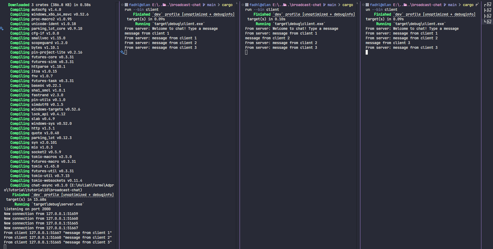

# Async Tutorial Broadcast Chat

## Reflection

Experiment 2.1: Original code, and how it runs

To try the broadcast chat, I first ran the server using `cargo run --bin server` in one terminal. Then, I opened three more terminals and ran `cargo run --bin client` in each one to start three clients. The server listens for incoming connections on port 2000. Every time a client connects, the server prints a message like `New connection from...` in its console.

When I type a message (for example, "Hello") in one client, the server prints `From client ... "Hello"`, and all other connected clients receive and display `From server: Hello`. The server keeps track of all connected clients, so whenever any client sends a message, all clients receive it. This shows how asynchronous programming and websockets allow real-time communication between multiple clients and the server.

