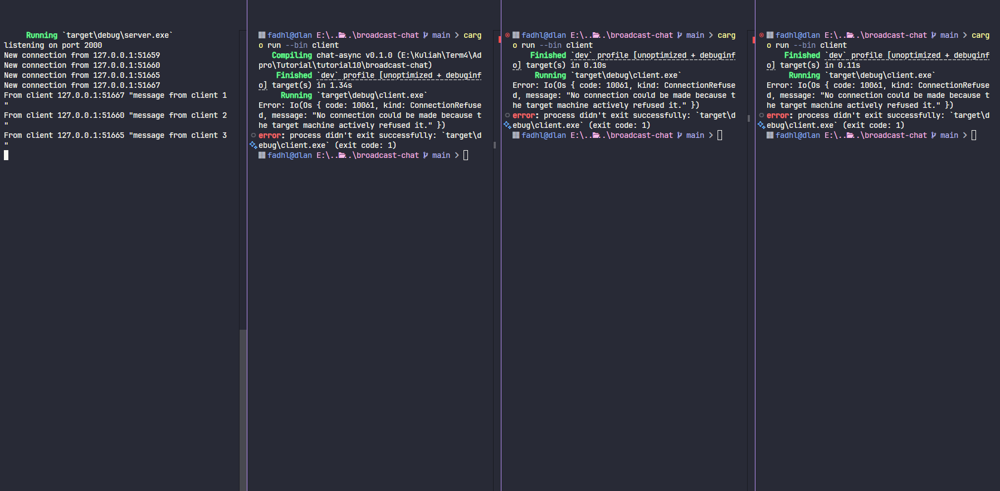
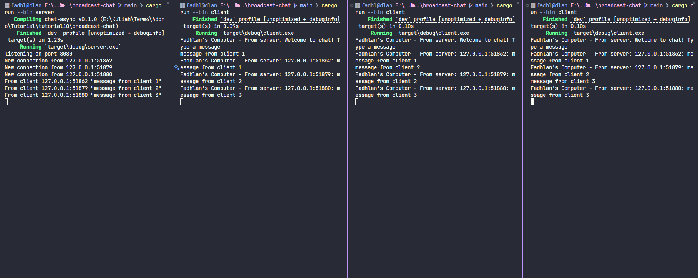

# Async Tutorial Broadcast Chat

## Reflection

Experiment 2.1: Original code, and how it runs

To try the broadcast chat, I first ran the server using `cargo run --bin server` in one terminal. Then, I opened three more terminals and ran `cargo run --bin client` in each one to start three clients. The server listens for incoming connections on port 2000. Every time a client connects, the server prints a message like `New connection from...` in its console.

When I type a message (for example, "Hello") in one client, the server prints `From client ... "Hello"`, and all other connected clients receive and display `From server: Hello`. The server keeps track of all connected clients, so whenever any client sends a message, all clients receive it. This shows how asynchronous programming and websockets allow real-time communication between multiple clients and the server.

Experiment 2.2: Modifying port

The result above is similar to the previous experiment, where the server can accept connections from three different clients. However, when I changed the port in the server code and then tried to run the client again, I got an "access is denied" error. This happened because the server keeps track of connections from clients on a specific port. If the port is different, the client sends a request to another port, so the access is not fulfilled and an error occurs. This shows that the client and server can only interact properly if they are connected to the same port.

To make the application work on port 8080, I needed to change the port number in both the server and client code. In the server, the port is set in the `TcpListener::bind("127.0.0.1:8080")` line. In the client, the port is set in the WebSocket URI: `ws://127.0.0.1:8080`. Both use the same WebSocket protocol, which is defined by the `tokio-websockets` crate in the code. If the ports do not match, the connection will fail.

Experiment 2.3: Small changes, add IP and Port

I updated the client and server code so that each message now shows the IP and Port of the client who sent it. This helps us identify which message comes from which client, since we do not have a username for each sender. By including the sender's IP and Port, it is easier to distinguish the source of each message in the chat.